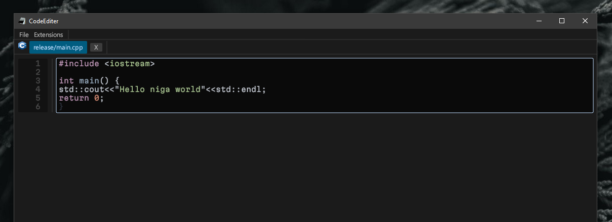

CodeEditer is an open source lightweight code editor for Windows. (No I don't know if Linux also works lmao)

## ✨ Features

====to fill out=====

## 📜 License

This project is licensed under the **GPL-3.0 License**. Check the `LICENSE` file for more infor
mation.
