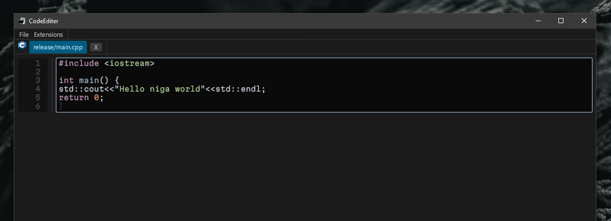

CodeEditer is an open source lightweight code editor for Windows.

## ✨ Features

* ⚙️ Lightweight - uses fewer resources than VS code it self.
* 🧩 Extensions - Customize your experience.
* 🛠️ - Simple UI without any clutter.

## 📜 License

This project is licensed under the **GPL-3.0 License**. Check the `LICENSE` file for more information.

## ⚙️ Dependences

============

# 🖥️ Needed

OS: ``Windows Vista or Newer``
.NET Framework: ``4.5.2``
